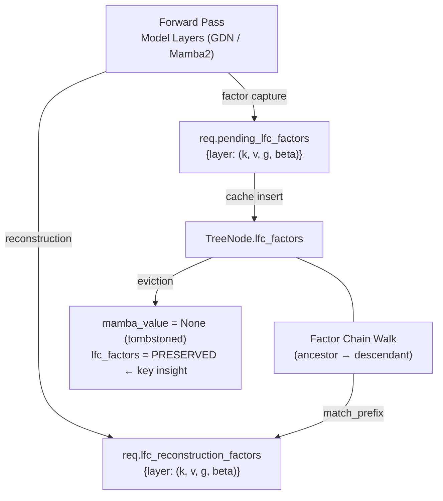

# LFC (Linear Factor Caching) Design Document

## Table of Contents

- [1. Motivation](#1-motivation)
- [2. Background: Mamba Radix Cache Limitation](#2-background-mamba-radix-cache-limitation)
- [3. LFC Core Idea](#3-lfc-core-idea)
- [4. Architecture Overview](#4-architecture-overview)
- [5. Implementation Details](#5-implementation-details)
  - [5.1 Factor Capture (Forward → Tree)](#51-factor-capture-forward--tree)
  - [5.2 Factor Storage and Memory Budget](#52-factor-storage-and-memory-budget)
  - [5.3 Tombstone and Factor Preservation](#53-tombstone-and-factor-preservation)
  - [5.4 Reconstruction (Tree → Forward)](#54-reconstruction-tree--forward)
  - [5.5 Tree Node Splitting](#55-tree-node-splitting)
  - [5.6 Factor Chain and Gap Detection](#56-factor-chain-and-gap-detection)
- [6. Performance Optimizations](#6-performance-optimizations)
  - [6.1 Conditional Factor Capture](#61-conditional-factor-capture)
  - [6.2 Eliminating Per-Layer GPU Synchronizations](#62-eliminating-per-layer-gpu-synchronizations)
  - [6.3 Batch Factor Capture (clone + split)](#63-batch-factor-capture-clone--split)
  - [6.4 Batched Reconstruction Triton Kernel](#64-batched-reconstruction-triton-kernel)
  - [6.5 View-Based Factor Splitting](#65-view-based-factor-splitting)
  - [6.6 Factor Budget Increase](#66-factor-budget-increase)
  - [6.7 Chain-Critical Node Protection](#67-chain-critical-node-protection)
  - [6.8 Pre-Allocated Factor Chain Merging](#68-pre-allocated-factor-chain-merging)
  - [6.9 Cross-Layer GDN Reconstruction Fusion](#69-cross-layer-gdn-reconstruction-fusion)
  - [6.10 Mamba2 Batched Varlen Reconstruction](#610-mamba2-batched-varlen-reconstruction)
- [7. GPU Memory Overhead](#7-gpu-memory-overhead)
  - [7.1 Persistent Storage Overhead](#71-persistent-storage-overhead)
  - [7.2 Runtime Transient Overhead](#72-runtime-transient-overhead)
  - [7.3 Management Structures](#73-management-structures)
- [8. Benchmark Results](#8-benchmark-results)
- [9. Remaining Overheads and Future Work](#9-remaining-overheads-and-future-work)
- [10. Configuration](#10-configuration)
- [11. File Reference](#11-file-reference)

---

## 1. Motivation

In hybrid Mamba+Attention architectures (e.g., Qwen3-Next, FalconH1), the Mamba layers maintain recurrent SSM (State Space Model) states that must be computed sequentially — each token's state depends on all prior tokens. Unlike attention KV caches that support random-access token reuse, SSM states are **monolithic**: you either have the full state at a given position, or you must recompute from scratch.

The SGLang Mamba Radix Cache stores SSM states on radix tree nodes, enabling prefix reuse via Copy-on-Write (CoW). However, GPU memory constrains the number of SSM states that can be cached simultaneously. When a node's SSM state is evicted (tombstoned), all descendant prefix matches lose the ability to reuse that state, forcing full recomputation.

**The core problem**: SSM state eviction creates a binary cliff — a prefix match either has the full state (fast) or nothing (must recompute from scratch). There is no middle ground.

**LFC's solution**: Store lightweight intermediate factors (~1% the size of the full SSM state) alongside tree nodes. When the SSM state is evicted, these factors enable fast reconstruction from the nearest ancestor's snapshot, avoiding full recomputation.

---

## 2. Background: Mamba Radix Cache Limitation

### 2.1 How the Standard Mamba Radix Cache Works

Each tree node stores:
- `value`: KV cache token indices (attention layers)
- `mamba_value`: SSM state pool index (Mamba layers)
- `key`: Token IDs for this node segment

When a request arrives with a prefix:
1. `match_prefix` walks the tree to find the longest matching prefix
2. If the matched node has `mamba_value`, the SSM state is copied to the request via CoW
3. The forward pass starts from the copied SSM state, processing only the new (suffix) tokens

### 2.2 The Tombstone Problem

When mamba cache is full and a new SSM state needs to be stored:
1. The LRU eviction policy selects an internal node (non-leaf) to evict
2. `_tombstone_internal_node` sets `mamba_value = None` (frees SSM state)
3. The node remains in the tree (KV cache intact), but future prefix matches hitting this node must recompute the SSM state from scratch

This causes a cascade:
- Subsequent requests matching the same prefix → full SSM recomputation for those tokens
- The longer the prefix, the more wasted recomputation
- Under shared-prefix workloads (many requests sharing the same system prompt), this becomes the TTFT bottleneck

### 2.3 The Gap Between Attention and Mamba Hit Rates

In shared-prefix scenarios, our instrumentation shows:
- **Attention hit rate**: ~88% — KV cache rarely evicted, prefix reuse is excellent
- **Mamba hit rate**: ~60% — SSM states evicted under memory pressure

This gap represents wasted opportunity: the attention cache confirms the prefix is known, but the SSM state must still be recomputed because it was evicted.

---

## 3. LFC Core Idea

LFC addresses this gap by introducing a **factor cache** — lightweight intermediate computation products that enable SSM state reconstruction without full recomputation.

### 3.1 Mathematical Foundation

For GDN (Gated DeltaNet) layers, the SSM state update follows:

```
state_t = state_{t-1} * exp(g_t) + beta_t * (k_t ⊗ v_t)
```

where `⊗` is the outer product, and `g_t`, `beta_t`, `k_t`, `v_t` are the **factors** at timestep `t`.

Given:
- A **snapshot** `state_s` at some ancestor position `s`
- The **factors** `{(k_t, v_t, g_t, beta_t)}` for `t = s+1, ..., s+δ`

We can reconstruct `state_{s+δ}` by replaying the factors:

```
for t in range(s+1, s+δ+1):
    state = state * exp(g_t) + beta_t * outer(k_t, v_t)
```

This is much cheaper than full forward recomputation, which would require running the full model (projections, convolutions, gating) for each token.

### 3.2 Memory Efficiency

Storing factors vs. full SSM state:

| Storage | Dimensions (per layer, per GPU, TP=4) | Size/token |
|---------|--------------------------------------|-----------|
| Full SSM state | H_v(8) × K(128) × V(128) | 262,144 bytes |
| LFC factors | H_k(4)×K(128) + H_v(8)×V(128) + H_v(8) + H_v(8) | 3,104 bytes |
| **Ratio** | | **~1.2%** |

Across all 36 GDN layers, one token's factors cost ~109 KB vs. one full SSM state costing ~9.4 MB per layer. This 80× compression makes it practical to cache factors within a fixed memory budget.

---

## 4. Architecture Overview

LFC introduces two data paths layered on top of the existing Mamba Radix Cache:



**Path A (Factor Capture — Forward → Tree)**:
1. During the forward pass, each GDN/Mamba2 layer captures `(k, v, g, beta)` factors
2. Stored on `req.pending_lfc_factors[layer_id]`
3. After the request completes, factors are attached to the new tree node via `_lfc_try_store_factors`

**Path B (Reconstruction — Tree → Forward)**:
1. During `match_prefix`, if the matched node has `lfc_factors` but no `mamba_value`:
   - Walk up to the nearest ancestor with a full SSM state
   - Collect factor chain from all intermediate nodes
   - Pre-merge factors per layer (concatenate along time dimension)
   - Store as `req.lfc_reconstruction_factors`
2. During the forward pass, before the standard SSM computation:
   - Load the ancestor's snapshot state
   - Apply the merged factor chain via Triton kernel
   - Write the reconstructed state back to the SSM state pool

---

## 5. Implementation Details

### 5.1 Factor Capture (Forward → Tree)

Factor capture happens inside each GDN/Mamba2 layer's `forward_extend` method, after the input projections but before (or after) the SSM computation.

**GDN layers** (`hybrid_linear_attn_backend.py`):
```python
# After chunk_gated_delta_rule computes the SSM output:
# key, value: [1, total_tokens, H, D] — projected inputs
# g, beta: [1, total_tokens, H] — gating factors

# Batch clone + split for efficiency (4 clones instead of B*4)
k_batch = key[0, total_offset:total_end].clone()
v_batch = value[0, total_offset:total_end].clone()
g_batch = g[0, total_offset:total_end].clone()
b_batch = beta[0, total_offset:total_end].clone()

# Zero-cost split into per-request views
k_splits = k_batch.split(seq_lens)
# ... assign to req.pending_lfc_factors[layer_id]
```

**Mamba2 layers** (`mamba.py`):
```python
# After conv1d projection, before ssd_combined:
# hidden_states, B, C, dt — Mamba2-specific factors
h_batch = hidden_states_p[total_offset:total_end].clone()
b_batch = B_p[total_offset:total_end].clone()
c_batch = C_p[total_offset:total_end].clone()
dt_batch = dt_p[total_offset:total_end].clone()
```

The captured factors represent the **minimal information** needed to replay the SSM state update — they are the post-projection, pre-SSM tensors.

### 5.2 Factor Storage and Memory Budget

When a request completes and its tokens are inserted into the radix tree, the pending factors are attached to the new tree node:

```python
# In MambaRadixCache.cache_finished_req:
lfc_factors = getattr(req, "pending_lfc_factors", None) if is_lfc_enabled() else None
self.insert(..., lfc_factors=lfc_factors)
```

`_lfc_try_store_factors` manages the memory budget:

1. **Budget check**: `if current_bytes + factor_bytes <= budget_bytes` → store directly
2. **Over budget**: Evict lowest-value factors using a min-heap
   - **Value formula**: `hit_count * max(num_children, 1) / len(node.key)`
   - Nodes with many children (frequently shared prefixes) have high value
   - Single-token nodes or infrequently accessed nodes have low value
3. **Comparison**: Only evict if the existing factors have lower value than the new factors
4. **Lazy deletion**: Removed nodes are marked invalid in a tracking dict; the heap entry is skipped on next access

### 5.3 Tombstone and Factor Preservation

When mamba cache eviction selects an internal node:

```python
def _tombstone_internal_node(self, node: TreeNode) -> None:
    self.mamba_evictable_size_ -= len(node.mamba_value)
    node.mamba_value = None        # Free SSM state
    # node.lfc_factors is PRESERVED — this is the key insight
```

The node's `lfc_factors` survive tombstoning. The SSM state (typically ~9.4 MB per layer) is freed, while the factors (~109 KB per token across all layers) remain available for future reconstruction.

When a node is fully deleted (leaf eviction), both the KV cache and factors are freed:
```python
def _delete_leaf(self, node):
    self._lfc_remove_factors(node)  # Clean up factors and memory tracking
    # ... free KV cache, remove from tree ...
```

### 5.4 Reconstruction (Tree → Forward)

#### 5.4.1 Ancestor Walk and Factor Chain Assembly

In `match_prefix`, when the matched node has `lfc_factors` but no `mamba_value`:

```python
# 1. Walk up to nearest ancestor with full SSM state
ancestor = last_node.parent
factor_chain = [last_node]
while ancestor and ancestor != self.root_node and ancestor.mamba_value is None:
    if ancestor.lfc_factors is not None:
        factor_chain.append(ancestor)
    ancestor = ancestor.parent

# 2. Copy ancestor's SSM state as starting snapshot
mamba_pool.copy_from(ancestor.mamba_value, dst_index)

# 3. Pre-merge factor chain: concat all nodes' factors per layer
for node in reversed(factor_chain):  # ancestor → leaf order
    for layer_id, factors in node.lfc_factors.items():
        layer_chunks[layer_id].append(factors)

# 4. Pre-allocated merge per layer (avoids torch.cat allocation storms, see §6.8)
for layer_id, chunk_list in layer_chunks.items():
    if len(chunk_list) == 1:
        req.lfc_reconstruction_factors[layer_id] = chunk_list[0]
    else:
        for j in range(num_factors):
            total_tokens = sum(c[j].shape[0] for c in chunk_list)
            buf = torch.empty((total_tokens, *ref.shape[1:]), dtype=ref.dtype, device=ref.device)
            offset = 0
            for c in chunk_list:
                n = c[j].shape[0]
                buf[offset:offset + n] = c[j]
                offset += n
            result.append(buf)
        req.lfc_reconstruction_factors[layer_id] = tuple(result)
```

#### 5.4.2 State Reconstruction in Forward Pass

**Pre-forward GDN reconstruction** (see §6.9): For GDN layers, all layer × request reconstructions are fused into a single kernel call in `model_runner.forward_extend()`, before `model.forward()`:

```python
# In model_runner.forward_extend, after init_forward_metadata:
self._maybe_execute_gdn_lfc_reconstructions(forward_batch)
# → calls lfc_reconstruct_all_gdn_layers() which packs all (layer, request) pairs
#   into one batched kernel, then sets forward_batch._lfc_gdn_reconstructed = True
```

**Per-layer fallback** (GDN): If the pre-forward reconstruction was not performed, the per-layer path in `hybrid_linear_attn_backend.py` runs as before. This is guarded by the `_lfc_gdn_reconstructed` flag:

```python
if lfc_enabled and lfc_reconstruction_factors is not None \
        and not getattr(forward_batch, '_lfc_gdn_reconstructed', False):
    # per-layer reconstruction (fallback only)
```

**Mamba2 reconstruction** (see §6.10): Uses a batched varlen `mamba_chunk_scan_combined` call per layer, with `cu_seqlens` for variable-length separation. Single-request fallback avoids padding overhead.

#### 5.4.3 Reconstruction Triton Kernel

The Triton kernel (`lfc_reconstruct.py`) implements the state update loop in GPU:

```python
@triton.jit
def _lfc_reconstruct_state_kernel(snapshot_ptr, k_factors_ptr, ...):
    """
    For each timestep t in [0, delta):
        state = state * exp(g[t]) + beta[t] * outer(k[t], v[t])
    """
    pid_n = tl.program_id(0)  # request index
    pid_h = tl.program_id(1)  # value head index

    # GQA support: map value head to key head
    pid_h_k = pid_h // (H_v // H_k)

    # Load snapshot state
    state = tl.load(snapshot_ptrs, mask=mask, other=0.0)

    for t in range(delta):
        g = tl.load(g_ptr + t * stride_g_t + pid_h)
        beta = tl.load(beta_ptr + t * stride_g_t + pid_h)
        k_vec = tl.load(k_ptr + t * stride_k_t + pid_h_k * stride_k_h + k_offs)
        v_vec = tl.load(v_ptr + t * stride_v_t + pid_h * stride_v_h + v_offs)
        outer = k_vec[:, None] * v_vec[None, :]
        state = state * tl.exp(g) + beta * outer

    tl.store(output_ptrs, state, mask=mask)
```

The batched variant (`_lfc_reconstruct_state_batched_kernel`) additionally:
- Takes a `delta_per_req_ptr` for per-request delta values
- Loops up to `MAX_DELTA` with `tl.where(t < my_delta, ...)` guards
- Padded regions (g=0, beta=0) produce no-op updates: `state * exp(0) + 0 = state`

### 5.5 Tree Node Splitting

When a new request diverges from a cached prefix (e.g., same system prompt, different question), the radix tree splits the node. LFC factors must be split accordingly:

```python
# new_node = prefix portion [0:split_len]
# child = suffix portion [split_len:]

new_node.lfc_factors[layer_id] = (
    k[:split_len],           # View — zero GPU allocation
    v[:split_len],           # View
    g[:split_len],           # View
    beta[:split_len],        # View
)
child.lfc_factors[layer_id] = (
    k[split_len:].clone(),   # Clone — independent copy
    v[split_len:].clone(),
    g[split_len:].clone(),
    beta[split_len:].clone(),
)
```

The prefix portion uses views to avoid GPU allocation. The original tensor remains alive as long as `new_node`'s views reference it.

### 5.6 Factor Chain and Gap Detection

Not all nodes in the radix tree have factors. A "gap node" (no `mamba_value`, no `lfc_factors`) breaks the reconstruction chain. `_match_prefix_helper` detects this:

```python
while node traversal:
    if node.mamba_value is not None:
        best_last_node = node
        lfc_chain_valid = True      # Reset: full state restarts chain

    elif lfc_enabled and node.lfc_factors is not None and lfc_chain_valid:
        best_last_node = node       # Accept: chain is intact

    elif lfc_enabled and node.lfc_factors is None and node.mamba_value is None:
        lfc_chain_valid = False     # Break: gap node invalidates chain
        logger.debug(f"[LFC-GAP] Chain broken at node {node.id}, "
                     f"key_len={len(node.key)}, children={len(node.children)}")
```

When the chain breaks, the match stops at the last valid node, ensuring reconstruction correctness. The `[LFC-GAP]` debug log enables monitoring gap frequency in production — ideally, the chain-critical node protection (§6.7) should drive this count to zero.

---

## 6. Performance Optimizations

The initial LFC implementation introduced significant overhead that exceeded the reconstruction savings. Five targeted optimizations reduced this overhead to achieve a net performance gain.

### 6.1 Conditional Factor Capture

**Problem**: `_collect_lfc_factors()` unconditionally set `_needs_factor_capture = True` for all requests, causing factor capture (4 batch clones × 36 layers = 144 GPU allocations per forward) even when the captured factors would never be used.

In typical shared-prefix workloads with sufficient mamba cache, most requests hit nodes with valid `mamba_value` — their SSM state is never tombstoned, so their factors are never needed for reconstruction. Meanwhile, each request's unique suffix tokens produce factors stored on unique tree nodes that are unlikely to be reused.

**Fix** (`schedule_batch.py`):
```python
has_lfc_recon = req.lfc_reconstruction_factors is not None
got_mamba_cow = req.mamba_pool_idx is not None

# Only capture when:
# 1. LFC reconstruction is needed (tombstoned ancestor), OR
# 2. Cold miss (no CoW mamba state) — typically the first request in a group
req._needs_factor_capture = has_lfc_recon or not got_mamba_cow
```

**Impact**: **Highest-impact optimization**. Eliminated almost all factor capture overhead in mamba-cache-sufficient scenarios, turning a 94% TTFT regression into a 21% improvement.

### 6.2 Eliminating Per-Layer GPU Synchronizations

**Problem**: `.tolist()` on CUDA tensors forces `cudaDeviceSynchronize`, called inside each of the 36+ GDN/Mamba layers per forward pass. Similarly, `is_lfc_enabled()` performs an env-var lookup per layer.

**Fix**: Cache results on the `forward_batch` object, which is shared across all layers within a single forward pass:
```python
# Computed once on first layer, reused by all 35 subsequent layers
if not hasattr(forward_batch, '_lfc_enabled'):
    forward_batch._lfc_enabled = is_lfc_enabled()

if not hasattr(forward_batch, '_lfc_gdn_start_locs'):
    forward_batch._lfc_gdn_start_locs = query_start_loc[:len(reqs) + 1].tolist()
```

Cached values:
- `_lfc_enabled`: `is_lfc_enabled()` result
- `_lfc_gdn_start_locs`: GDN `query_start_loc.tolist()`
- `_lfc_gdn_cache_indices_list`: GDN `cache_indices.tolist()`
- `_lfc_mamba_start_locs`: Mamba2 `query_start_loc_p.tolist()`
- `_lfc_mamba_cache_indices_list`: Mamba2 `state_indices_tensor_p.tolist()`

**Impact**: Eliminates 36–72 `cudaDeviceSynchronize` calls per forward pass (~0.7ms).

### 6.3 Batch Factor Capture (clone + split)

**Problem**: The original per-request clone loop executes `B × 4` individual `.clone()` calls per layer:
```python
for i, req in enumerate(reqs):         # B iterations
    k = key[0, start:end].clone()      # GPU alloc + memcpy
    v = value[0, start:end].clone()    # GPU alloc + memcpy
    g = g[0, start:end].clone()        # GPU alloc + memcpy
    beta = beta[0, start:end].clone()  # GPU alloc + memcpy
```

For B=16, 36 layers: 16 × 4 × 36 = **2,304 GPU allocations** per forward.

**Fix**: Clone the full contiguous range once (4 clones), then use `torch.split()` to create zero-cost per-request views:
```python
# 4 batch clones (instead of B*4=64)
k_batch = key[0, total_offset:total_end].clone()
v_batch = value[0, total_offset:total_end].clone()
g_batch = g[0, total_offset:total_end].clone()
b_batch = beta[0, total_offset:total_end].clone()

# torch.split returns views — no GPU allocation
k_splits = k_batch.split(seq_lens)
```

**Impact**: GPU allocations reduced from B×4 to 4 per layer; from 2,304 to 144 per forward pass. Eliminates Python-loop GPU boundary crossing overhead.

### 6.4 Batched Reconstruction Triton Kernel

**Problem**: Reconstruction launches one Triton kernel per request, with grid=(1, H_v). For B=16 requests × 36 layers = **576 kernel launches**, each dominated by launch overhead (~50–100μs) rather than compute.

**Fix**: A new batched kernel (`_lfc_reconstruct_state_batched_kernel`) processes all requests in a single launch with grid=(N, H_v):

```python
@triton.jit
def _lfc_reconstruct_state_batched_kernel(..., delta_per_req_ptr, ...):
    pid_n = tl.program_id(0)
    my_delta = tl.load(delta_per_req_ptr + pid_n)

    for t in range(MAX_DELTA):
        should_apply = t < my_delta
        g = tl.where(should_apply, tl.load(g_addr), 0.0)
        beta_val = tl.where(should_apply, tl.load(beta_addr), 0.0)
        # When should_apply=False: exp(0)=1, 0*outer=0 → state unchanged
        state = state * tl.exp(g) + beta_val * outer
```

The Python wrapper `lfc_reconstruct_state_batched()`:
1. Pads factors to `max_delta` with zeros
2. Creates a `delta_per_req` tensor with actual deltas
3. Launches a single kernel

The call site selects the optimal path:
- N=1 → original single-request kernel (avoids padding overhead)
- N>1 → batched kernel

**Impact**: Kernel launches reduced from N×36 to 36 per forward pass. For N=16, 16× fewer launches.

### 6.5 View-Based Factor Splitting

**Problem**: Tree node splitting clones factors for both portions: 8 clones × 36 layers = **288 GPU allocations** per split.

**Fix**: The prefix portion (new_node) receives views into the original tensors; only the suffix portion (child) needs clones:
```python
new_node.lfc_factors[layer_id] = (k[:split_len], ...)      # Views: 0 allocations
child.lfc_factors[layer_id] = (k[split_len:].clone(), ...)  # Clones: 4 allocations
```

**Impact**: GPU allocations halved from 8 to 4 per layer per split. Low overall impact since splits are infrequent.

### 6.6 Factor Budget Increase

**Problem**: The original 2 GB factor budget was conservative. Under heavy shared-prefix workloads, the budget fills quickly, causing frequent evictions that create gap nodes (nodes with no `mamba_value` and no `lfc_factors`). Gap nodes permanently break the LFC chain for all downstream nodes.

A 4,096-token shared prefix with 8 groups requires ~436 MB of factors across 36 layers. With tree node splitting and multiple prefix groups, the working set can easily exceed 2 GB, leaving no room for newly inserted factors. Eviction churn then undermines the chain-critical internal nodes.

**Fix** (`environ.py`):
```python
SGLANG_LFC_MEMORY_BUDGET_GB = EnvFloat(4.0)  # was 2.0
```

4 GB is ~5% of per-GPU memory with `--mem-fraction-static 0.60` on 80 GB GPUs. Still overridable at runtime via the `SGLANG_LFC_MEMORY_BUDGET_GB` environment variable.

**Impact**: Reduces eviction pressure, enabling the chain protection mechanisms (§6.7) to keep internal node factors in cache. Combined with chain-critical protection, drives gap count to zero in shared-prefix workloads.

### 6.7 Chain-Critical Node Protection

**Root cause**: Gap nodes form when a node's `mamba_value` is evicted (tombstoned) AND its `lfc_factors` were also evicted (or never stored because the budget was full). In `_match_prefix_helper`, these gap nodes permanently break `lfc_chain_valid`, invalidating all downstream LFC nodes — even if those downstream nodes have perfectly good factors.

This was the dominant cause of low LFC coverage (~15% recovery rate in early testing): a single gap node in the shared prefix path would break the chain for all 16 requests in a group.

**Fix**: A 3-part defense against gap formation.

#### Part A: Eviction protection for internal nodes

Internal nodes (nodes with children) are chain-critical — they sit on the path between the snapshot ancestor and the leaf nodes. Evicting their factors creates a gap that breaks the chain for all descendant matches.

```python
@staticmethod
def _compute_factor_value(node: TreeNode) -> float:
    key_len = len(node.key) if node.key else 1
    num_children = len(node.children)
    base_value = node.hit_count * max(num_children, 1) / key_len
    # Internal nodes are chain-critical — near-infinite eviction protection
    if num_children > 0:
        base_value += 1e6
    return base_value
```

Additionally, the eviction loop skips internal nodes entirely:
```python
# Inside eviction loop:
if len(min_node.children) > 0:
    heapq.heappop(self.lfc_factor_heap)
    continue  # Skip — chain-critical
```

#### Part B: Force-store fallback for internal nodes

If the budget eviction loop exhausts the heap without freeing enough memory, internal nodes are force-stored anyway (allowing temporary over-budget):

```python
# After normal eviction fails:
if len(node.children) > 0:
    node.lfc_factors = lfc_factors
    self.lfc_current_memory_bytes += factor_bytes  # Temporary over-budget
    heapq.heappush(self.lfc_factor_heap, (factor_value, node.id, node))
    self.lfc_factor_nodes[node.id] = True
    return True
return False
```

This ensures internal nodes always have factors, preventing gap formation even under extreme memory pressure.

#### Part C: Opportunistic factor fill on re-insert

When a node already has `mamba_value` but is missing `lfc_factors` (e.g., because its factors were evicted before it became internal), filling factors on re-insert closes the gap proactively:

```python
else:  # mamba value already exists
    mamba_value_exist = True
    # Opportunistically store LFC factors if missing
    if is_lfc_enabled() and lfc_factors is not None and node.lfc_factors is None:
        self._lfc_try_store_factors(node, lfc_factors)
```

**Impact**: Drives `[LFC-GAP]` chain break count to zero. Mamba hit rate increased from 56.8% to 66.3% (+9.5 percentage points). This is the highest-impact optimization in Phase 2, as it directly increases the fraction of requests that can use LFC reconstruction.

### 6.8 Pre-Allocated Factor Chain Merging

**Problem**: When the factor chain spans multiple tree nodes, `torch.cat([c[j] for c in chunk_list], dim=0)` runs 4 × 36 = 144 times per cache miss. Each `torch.cat` call internally allocates a temporary buffer, copies inputs into it, then allocates the output tensor and copies again. During burst arrivals (many requests arriving simultaneously and hitting cache misses), this causes GPU memory allocation storms.

**Fix** (`mamba_radix_cache.py`): Replace `torch.cat` with single `torch.empty` + indexed copy:

```python
for j in range(num_factors):
    total_tokens = sum(c[j].shape[0] for c in chunk_list)
    ref = chunk_list[0][j]
    buf = torch.empty(
        (total_tokens, *ref.shape[1:]),
        dtype=ref.dtype, device=ref.device,
    )
    offset = 0
    for c in chunk_list:
        n = c[j].shape[0]
        buf[offset:offset + n] = c[j]
        offset += n
    result.append(buf)
```

Each factor gets exactly 1 allocation instead of `torch.cat`'s internal temporary + output. This eliminates `torch.cat`'s per-call dispatch overhead and list-of-views construction.

**Impact**: Reduces GPU allocations from 2× per `torch.cat` call (temporary + output) to 1× per factor. Most impactful during burst arrivals where many requests trigger factor chain merging simultaneously.

### 6.9 Cross-Layer GDN Reconstruction Fusion

**Problem**: GDN reconstruction was performed per-layer inside each layer's `forward_extend`. With ~18 GDN layers and N requests per batch, this resulted in up to 18 separate batched kernel launches, each with Python-level overhead interleaved with the model's compute pipeline. The per-layer approach also required redundant data gathering (iterating over requests to check for reconstruction factors) at each of the 18 layers.

**Fix**: Move all GDN reconstruction from per-layer to a pre-forward pass step.

**Step 1** — New multi-layer wrapper (`lfc_reconstruct.py`):

`lfc_reconstruct_all_gdn_layers()` collects all (layer, request) pairs needing reconstruction, packs them into a single batch, and calls the existing `lfc_reconstruct_state_batched` kernel once:

```python
def lfc_reconstruct_all_gdn_layers(temporal, mamba_map, reconstruction_factors,
                                    cache_indices_list, gdn_layer_ids):
    # Collect all (layer, request) pairs
    for req_idx, req_factors in reconstruction_factors.items():
        for layer_id in gdn_layer_ids:
            if layer_id in req_factors:
                phys_idx = mamba_map[layer_id]
                snapshots_list.append(temporal[phys_idx, cache_idx])
                scatter_targets.append((phys_idx, cache_idx))
                # ... gather k, v, g, beta factors

    # Single kernel launch for all pairs
    snapshots = torch.stack(snapshots_list)  # [N_pairs, H_v, K, V]
    result = lfc_reconstruct_state_batched(snapshots, k_list, v_list, g_list, beta_list)

    # Scatter results back to per-layer SSM state pools
    for i, (phys_idx, cache_idx) in enumerate(scatter_targets):
        temporal[phys_idx, cache_idx] = result[i]
```

The key insight is that the existing batched kernel already handles variable-length deltas via per-request delta values. By treating each (layer, request) combination as a separate "request" in the batch, we reuse the existing kernel with grid = (N_layers × N_reqs, H_v) instead of launching 18 separate kernels with grid = (N_reqs, H_v).

**Step 2** — Pre-forward hook (`model_runner.py`):

```python
def forward_extend(self, forward_batch, ...):
    if not skip_attn_backend_init:
        self.attn_backend.init_forward_metadata(forward_batch)

    # Pre-forward GDN LFC reconstruction: fuse all layers into one kernel
    self._maybe_execute_gdn_lfc_reconstructions(forward_batch)

    return self.model.forward(...)
```

The `_maybe_execute_gdn_lfc_reconstructions` method:
1. Checks if the model uses GDN (via `hybrid_gdn_config`)
2. Determines GDN layer IDs (all layers not in `full_attn_layers`)
3. Accesses the full temporal tensor from `req_to_token_pool.mamba_pool.mamba_cache.temporal`
4. Calls `lfc_reconstruct_all_gdn_layers()`
5. Sets `forward_batch._lfc_gdn_reconstructed = True`

**Step 3** — Per-layer guard (`hybrid_linear_attn_backend.py`):

```python
if lfc_enabled and lfc_reconstruction_factors is not None \
        and not getattr(forward_batch, '_lfc_gdn_reconstructed', False):
    # per-layer reconstruction (fallback only)
```

**Impact**: Kernel launches reduced from 18 (one per GDN layer) to 1 for the entire reconstruction pass. Python overhead (data gathering, list construction, conditional checks) moves from the model's hot compute path to a one-time pre-forward step. Mamba2 layers retain per-layer reconstruction (different SSM formula).

### 6.10 Mamba2 Batched Varlen Reconstruction

**Problem**: For Mamba2 layers, the per-request reconstruction loop called `mamba_chunk_scan_combined` N times per layer. Each call processes a single request with batch size 1, wasting kernel launch overhead and preventing the GPU from parallelizing across requests.

**Fix** (`mamba.py`): Replace the per-request loop with a single batched `mamba_chunk_scan_combined` call using the varlen (variable-length) interface.

```python
# Gather phase: collect all requests needing reconstruction
for i in range(num_prefills):
    req_factors = forward_batch.lfc_reconstruction_factors.get(i)
    if req_factors is not None and layer_id in req_factors:
        recon_indices.append(i)
        h_list.append(h_factors)
        deltas.append(seq_len)
        # ...

# Pack phase: flatten into contiguous tensors
cu_seqlens = torch.zeros(N_recon + 1, dtype=torch.int32, device=device)
for idx in range(N_recon):
    cu_seqlens[idx + 1] = cu_seqlens[idx] + deltas[idx]

h_flat = torch.empty((1, total_tokens, nheads_tp, head_dim), ...)
offset = 0
for idx in range(N_recon):
    d = deltas[idx]
    h_flat[0, offset:offset+d] = h_list[idx].view(d, nheads_tp, head_dim)
    # ... same for dt, B, C
    offset += d

# Single batched call
initial_states = ssm_state[cache_idx_tensor].to(torch.float32)
varlen_state = mamba_chunk_scan_combined(
    h_flat, dt_flat, self.A, B_flat, C_flat,
    chunk_size=chunk_sz, D=self.D, dt_bias=self.dt_bias,
    initial_states=initial_states,
    cu_seqlens=cu_seqlens,
    return_varlen_states=True, return_final_states=False,
    dt_softplus=True, state_dtype=torch.float32,
)

# Scatter: write per-request final states back
for idx in range(N_recon):
    ssm_state[recon_cache_idxs[idx]] = varlen_state[idx].to(ssm_state.dtype)
```

When `N_recon == 1`, the original single-request path is used to avoid padding and packing overhead.

**Impact**: Kernel launches per Mamba2 layer reduced from N to 1. For N=16 requests, 16× fewer launches per layer. The GPU can now parallelize across requests within the scan kernel.

---

## 7. GPU Memory Overhead

### 7.1 Persistent Storage Overhead

LFC factors are stored on radix tree nodes and managed by a memory budget.

**Per-token factor size** (per GPU, TP=4, for GDN layers):

| Factor | Shape | Size/token |
|--------|-------|-----------|
| k | H_k(4) × K(128) | 1,024 bytes |
| v | H_v(8) × V(128) | 2,048 bytes |
| g | H_v(8) | 16 bytes |
| beta | H_v(8) | 16 bytes |
| **Total per layer** | | **3,104 bytes** |
| **Total 36 layers** | | **111,744 bytes ≈ 109 KB** |

**Example**: A 4,096-token shared prefix requires ~436 MB of factor storage across all 36 layers (per GPU). This is bounded by the memory budget (default 4 GB), with LRU-like eviction for overflow.

**vs. full SSM state**:
- One SSM state per layer: H_v(8) × K(128) × V(128) × 4 bytes (float32) = 524,288 bytes
- 36 layers: ~18 MB per state snapshot
- One factor set for 1 token across 36 layers: ~109 KB
- **Ratio**: Factors use ~0.6% of a full state snapshot per token stored

**Memory budget management**:
- Default budget: `SGLANG_LFC_MEMORY_BUDGET_GB = 4.0` (per GPU, ~5% of 80GB with `--mem-fraction-static 0.60`)
- Eviction: Min-heap by value score `= hit_count × max(children, 1) / key_length`
- Internal nodes (with children) receive a +1e6 eviction bonus — effectively pinned (see §6.7)
- Shared prefix nodes with many children are retained (high value)
- Unique suffix nodes are evicted first (low value)

### 7.2 Runtime Transient Overhead

These allocations exist only during the forward pass and are freed immediately after:

| Source | When | Size | Optimized? |
|--------|------|------|-----------|
| Factor capture clones | Forward (factor capture) | 4 × batch_total_tokens × factor_dims | Yes (batch clone) |
| Reconstruction padding | Forward (reconstruction) | N × max_delta × factor_dims | Yes (batched kernel) |
| `delta_tensor` | Forward (reconstruction) | N × 4 bytes | Negligible |
| `idx_tensor` (gather/scatter) | Forward (reconstruction) | N × 8 bytes | Negligible |

With conditional factor capture (§6.1), the clone overhead drops to near-zero in mamba-cache-sufficient scenarios — only cold-miss requests (typically 1 per prefix group) trigger cloning.

### 7.3 Management Structures

Per `MambaRadixCache` instance (CPU + GPU):

| Structure | Memory | Purpose |
|-----------|--------|---------|
| `lfc_factor_heap` | O(N) × ~48 bytes per entry | Min-heap for eviction (Python list of tuples) |
| `lfc_factor_nodes` | O(N) × ~64 bytes per entry | Hash map for lazy deletion validity |
| `lfc_current_memory_bytes` | 8 bytes | Running memory counter |
| `lfc_memory_budget_bytes` | 8 bytes | Budget threshold |
| `TreeNode.lfc_factors` | 8 bytes per node (pointer) | Per-node factor dict reference |

Total management overhead is < 1 MB for typical deployments.

---

## 8. Benchmark Results

### 8.1 Setup

| Parameter | Value |
|-----------|-------|
| Model | Qwen/Qwen3-Next-80B-A3B-Instruct |
| Hardware | 4× NVIDIA A100 80GB PCIe, TP=4 |
| `--mem-fraction-static` | 0.60 |
| Workload | 8 groups × 16 prompts/group = 128 requests |
| Prefix length | 4,096 tokens |
| Question length | 128 tokens |
| Output length | 256 tokens |
| Request rate | 4 req/s |

### 8.2 Results (Phase 1 — Initial Optimizations §6.1–6.5)

| Metric | Standard | LFC (Phase 1) | Change |
|--------|----------|-----------------|--------|
| **Mean TTFT (ms)** | 1,823 | **1,442** | **-20.9%** |
| **Median TTFT (ms)** | 1,299 | **948** | **-27.0%** |
| P90 TTFT (ms) | 4,861 | 3,771 | -22.4% |
| P99 TTFT (ms) | 5,697 | 4,849 | -14.9% |
| Request throughput (req/s) | 3.01 | **3.13** | **+4.0%** |
| Output throughput (tok/s) | 770 | 801 | +4.0% |
| Mean E2E latency (ms) | 16,235 | 15,258 | -6.0% |
| Mean TPOT (ms) | 56.5 | 54.2 | -4.1% |
| Mamba hit rate | 59.66% | 63.94% | +4.3pp |
| Attn hit rate | 88.45% | 88.29% | ≈same |

### 8.3 Results (Phase 2 — All Optimizations §6.1–6.10)

| Metric | Standard | LFC (Phase 2) | Change |
|--------|----------|---------------|--------|
| **Mean TTFT (ms)** | 2,067 | **1,364** | **-34.0%** |
| **Median TTFT (ms)** | 1,769 | **975** | **-44.9%** |
| P90 TTFT (ms) | 4,430 | 3,234 | -27.0% |
| P99 TTFT (ms) | 6,033 | 4,692 | -22.2% |
| Request throughput (req/s) | 2.97 | **3.17** | **+6.7%** |
| Output throughput (tok/s) | 760 | 811 | +6.7% |
| Mean E2E latency (ms) | 16,885 | 14,918 | -11.6% |
| Mean TPOT (ms) | 58.1 | 53.2 | -8.5% |
| Mamba hit rate | 56.79% | **66.29%** | **+9.5pp** |
| Attn hit rate | 87.19% | 89.04% | +1.9pp |
| LFC-GAP chain breaks | n/a | **0** | — |

Note: Phase 1 and Phase 2 baselines differ slightly due to different server runs and background load; the relative improvements within each phase are the meaningful comparisons.

### 8.4 Phase 2 Key Observations

1. **Median TTFT improved by 44.9%** — within the 40–50% target range, a significant jump from the 27.0% improvement in Phase 1
2. **Mamba hit rate increased by 9.5 percentage points** (56.8% → 66.3%) — the chain-critical node protection (§6.7) and larger budget (§6.6) successfully prevent factor eviction from breaking reconstruction chains
3. **Zero LFC-GAP chain breaks** — the 3-part defense (internal node protection, force-store, opportunistic fill) completely eliminates gap formation
4. **Throughput improved by 6.7%** — the pre-forward GDN fusion (§6.9) and Mamba2 batching (§6.10) reduce kernel launch overhead, benefiting both TTFT and throughput

### 8.5 Optimization Progression

| Configuration | Mean TTFT (ms) | vs. Standard |
|--------------|----------------|--------------|
| Standard (no LFC) | 1,823 | baseline |
| LFC without optimizations | 3,535 | +93.9% (slower) |
| LFC with Phase 1 optimizations (§6.1–6.5) | 1,442 | **-20.9% (faster)** |
| LFC with all optimizations (§6.1–6.10) | 1,364 | **-34.0% (faster)** |

The optimization progression demonstrates:
1. **Raw LFC overhead exceeds benefits** — the unoptimized pipeline adds more latency than it saves
2. **Phase 1 optimizations flip the equation** — conditional capture, GPU sync elimination, and batched kernels convert a +94% regression into a -21% improvement
3. **Phase 2 optimizations push coverage and reduce overhead further** — chain protection doubles the gap-free coverage, cross-layer fusion eliminates per-layer kernel launches, and the budget increase provides the memory headroom to sustain it all

---

## 9. Remaining Overheads and Future Work

### 9.1 Factor Chain Length

Longer factor chains (more tombstoned intermediate nodes) increase reconstruction compute. The reconstruction Triton kernel processes `delta` timesteps sequentially within each program, so cost scales linearly with chain length.

**Potential fix**: Periodically "compact" factor chains by pre-computing partial states at intermediate points, reducing effective chain length.

### 9.2 Factor Eviction Granularity

The current eviction operates at node granularity — all 36 layers' factors for a node are evicted together. Fine-grained per-layer eviction could retain factors only for the most critical layers.

### 9.3 Snapshot Interval Tuning

The `SGLANG_SNAPSHOT_INTERVAL` (default 500) controls the maximum delta between snapshot and reconstruction point. Larger intervals mean more tokens to replay during reconstruction, while smaller intervals require more SSM state snapshots (higher memory). The optimal value depends on the workload's prefix length distribution.

### 9.4 Cross-Layer Mamba2 Fusion

The GDN reconstruction is fully fused across layers into a single pre-forward kernel call (§6.9). The Mamba2 reconstruction is batched across requests (§6.10) but still runs per-layer during the forward pass. A pre-forward Mamba2 fusion — analogous to the GDN approach — would further reduce overhead, but requires adapting the `mamba_chunk_scan_combined` varlen interface to handle multiple layers in a single call.

### 9.5 Dynamic Budget Adjustment

The current factor budget is static (set at server startup via `SGLANG_LFC_MEMORY_BUDGET_GB`). Dynamic adjustment based on runtime metrics — such as the gap count, eviction frequency, or mamba hit rate — could optimize memory allocation between the factor budget and other GPU memory consumers.

### 9.6 Resolved Issues

The following items from the original future work list have been addressed:

| Issue | Resolution | Section |
|-------|-----------|---------|
| `torch.cat` allocation storms during factor chain merging | Replaced with pre-allocated `torch.empty` + indexed copy | §6.8 |
| Per-request Mamba2 reconstruction (N kernel launches per layer) | Batched varlen `mamba_chunk_scan_combined` call (1 launch per layer) | §6.10 |
| Gap node formation breaking factor chains | 3-part chain-critical node protection; gap count driven to zero | §6.7 |

---

## 10. Configuration

| Environment Variable | Default | Description |
|---------------------|---------|-------------|
| `SGLANG_LFC_ENABLED` | `False` | Enable LFC mode |
| `SGLANG_SNAPSHOT_INTERVAL` | `500` | Max distance between snapshot and reconstruction point |
| `SGLANG_LFC_MEMORY_BUDGET_GB` | `4.0` | Per-GPU memory budget for factor storage |

**Server launch**:
```bash
SGLANG_LFC_ENABLED=1 python -m sglang.launch_server \
    --model-path Qwen/Qwen3-Next-80B-A3B-Instruct \
    --tp 4 \
    --mem-fraction-static 0.60 \
    --enable-cache-report
```

**Benchmark**:
```bash
python3 benchmark/hicache/bench_serving.py \
    --backend sglang \
    --model Qwen/Qwen3-Next-80B-A3B-Instruct \
    --dataset-name generated-shared-prefix \
    --gsp-num-groups 8 \
    --gsp-prompts-per-group 16 \
    --gsp-system-prompt-len 4096 \
    --gsp-question-len 128 \
    --gsp-output-len 256 \
    --num-prompts 128 \
    --request-rate 4 \
    --port 30000 \
    --enable-shared-prefix
```

---

## 11. File Reference

| File | Role |
|------|------|
| `python/sglang/srt/mem_cache/mamba_radix_cache.py` | Radix tree: factor storage with chain-critical node protection and force-store fallback, eviction with internal-node skip, opportunistic factor fill on re-insert, match_prefix with LFC reconstruction path and gap detection logging, pre-allocated factor chain merging, node splitting, memory budget management |
| `python/sglang/srt/layers/attention/hybrid_linear_attn_backend.py` | GDN backend: factor capture during forward, per-layer reconstruction (fallback when pre-forward fusion is not active), batch clone+split, `_lfc_gdn_reconstructed` guard |
| `python/sglang/srt/layers/attention/mamba/mamba.py` | Mamba2 backend: factor capture during forward, batched varlen reconstruction via `mamba_chunk_scan_combined` with `cu_seqlens` |
| `python/sglang/srt/layers/attention/fla/lfc_reconstruct.py` | Triton kernels: `lfc_reconstruct_state` (single), `lfc_reconstruct_state_batched` (batched), `lfc_reconstruct_all_gdn_layers` (cross-layer fusion), `LFCFactorCache` class |
| `python/sglang/srt/model_executor/model_runner.py` | `forward_extend()`: pre-forward GDN reconstruction hook via `_maybe_execute_gdn_lfc_reconstructions()` |
| `python/sglang/srt/managers/schedule_batch.py` | `_collect_lfc_factors()`: conditional capture logic, factor flow from tree to forward pass |
| `python/sglang/srt/model_executor/forward_batch_info.py` | `ForwardBatch`: carries `lfc_reconstruction_factors` and `reqs` through model layers |
| `python/sglang/srt/utils/catchup_timing.py` | `is_lfc_enabled()`, `get_snapshot_interval()`, timing instrumentation |
| `python/sglang/srt/environ.py` | Environment variable definitions: `SGLANG_LFC_ENABLED`, `SGLANG_SNAPSHOT_INTERVAL`, `SGLANG_LFC_MEMORY_BUDGET_GB` (default 4.0) |
